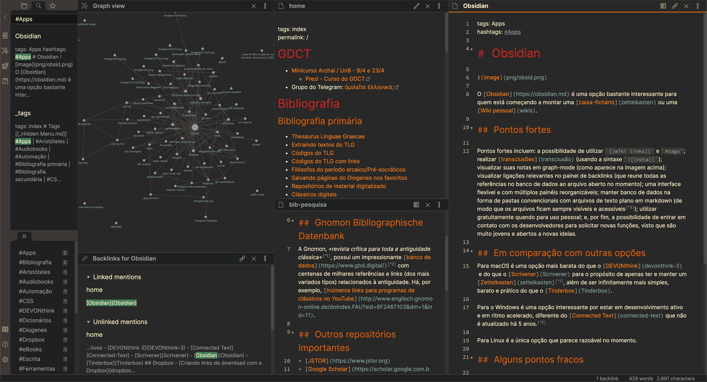

tags: Apps
hashtags: #Apps 

# Obsidian

O [Obsidian](https://obsidian.md) é uma opção bastante interessante para quem está começando a montar uma [caixa-fichário](zettelkasten) ou uma [Wiki pessoal](wikis). 

## Pontos fortes

Pontos fortes incluem: a possibilidade de utilizar `[[wiki links]]` e `#tags`; realizar [transclusões](transclusão) (usando a sintaxe `![[nota]]`); visualizar suas notas em graph-mode (como aparece na imagem acima); visualizar ligações relevantes no painel de backlinks (que reune todas as referências no banco de dados ao arquivo aberto no momento); uma interface flexível e com múltiplos painéis reorganizáveis; manter banco de dados na forma de pastas convencionais com arquivos de texto plano em markdown (de modo que os arquivos ficam sempre visíveis e acessíveis[^3]); utilizar gratuitamente quando para uso pessoal; e, por fim, a possibilidade de entrar em contato com os desenvolvedores para solicitar novas funções, visto que são muito jovens e abertos a novas ideias.
 
## Em comparação com outras opções
Para macOS é uma opção mais barata do que o [DEVONthink](devonthink-3) e do que o [Scrivener](Scrivener) para o propósito de apenas ter e manter um [Zettelkasten](zettelkasten)[^1], além de ser infinitamente mais simples, barato e prático do que o [Tinderbox](Tinderbox).

Para o Windows é uma opção interessante por estar em desenvolvimento ativo e em ritmo acelerado, diferente do [Connected Text](connected-text) que não é atualizado desde 2015.[^2]

Para Linux é a única opção que parece razoável no momento.

## Alguns pontos fracos

Obsidian é um software baseado em electron, que é tecnologia do Google Chrome (e a mesma utilizada pelo Diogenes). A vantagem dessa tecnologia é a compatibilidade com todos os sistemas operacionais (Windows, Linux e macOS). A desvantagem é ter um software com resquícios de um webapp; ou seja, são menos eficientes no uso de memória e não permitem algumas funções nativas do sistema operacional, como o corretor ortográfico do sistema, no caso do macOS. Além disso, há poucas possibilidades de associar metadados aos arquivos e é preciso não ignorar o fato de ainda ser um programa em fase de testes (a.k.a. em beta).

[^1]: Ele não serviria, entretanto, para organizar arquivos como o DEVONthink, nem para escrever textos longos textos, como o Scrivener.
[^2]: É claro que este último é um software muito mais maduro e completo, mas há uma preocupação real de que não seja corrigido se alguma atualização futura do Windows o tornar incompatível.
[^3]: Em alguns programas eles ficam ocultos e trancados dentro de bancos de dados.
[^4]: Eles são muito jovens e abertos a novas ideias.